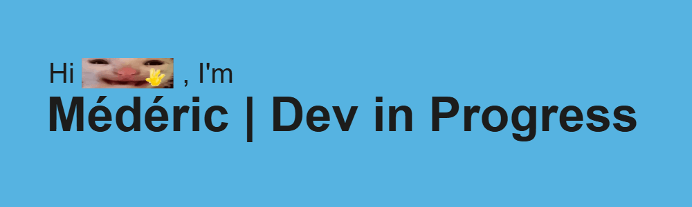

<!--------------------------------- ABOUT --------------------------------->

## 📖 About me

- 👨‍💻 I'm Médéric, a 21-years-old developer from  <b>Le Mans, France</b>.
- 🎓 I am a graduate of a French two-year IT degree (BTS SIO), with a focus on IT Systems and Network Administration (SISR).
- 🚀 I'm constantly learning and improving my programming skills through hands-on projects by following the

curriculum, and using resources like

and

!

### 📫 Contact me!

<!--------------------------------- SKILLS --------------------------------->

## 💻 Technologies that I use

| Category | Technologies |
|----------|--------------|
| **</> Web Development** |        |
| **🗄️ OS, Servers & DataBases** |        |
| **🛠️ Tools** |           |
| **⏳ Currently learning..** |         |

### 🎓 Past School Projects & Technologies

| **Web Development** | **Servers & Hosting** | **Systems, Networking & Virtualization** |
|-------------------------|-----------------------|------------------------------------------|
|   
       
 | 
         </b> 
 | 
             
 |

<!--------------------------------- SKILLS --------------------------------->

## 📂 Repositories

  
  

       

<!------------------------------ REPOSITORIES ------------------------------>

## ➡️ What’s Next...?

- #### 🚧 I'm currently working on..
  - Building my Portfolio
  - Completing the [FreeCodeCamp learning program](https://www.freecodecamp.org/mederic-mth)
  - Searching for a work-study position in France for september 2025

- #### 🎯 Goals for the Future..
  - Learning new technologies such as , , ,  ...
  - Gaining experience working as a developer before eventually transitioning to a freelance career
  - Creating a video game

<!--------------------------------- OTHERS --------------------------------->

<!-- Maybe later

-->
